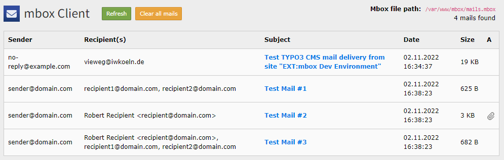
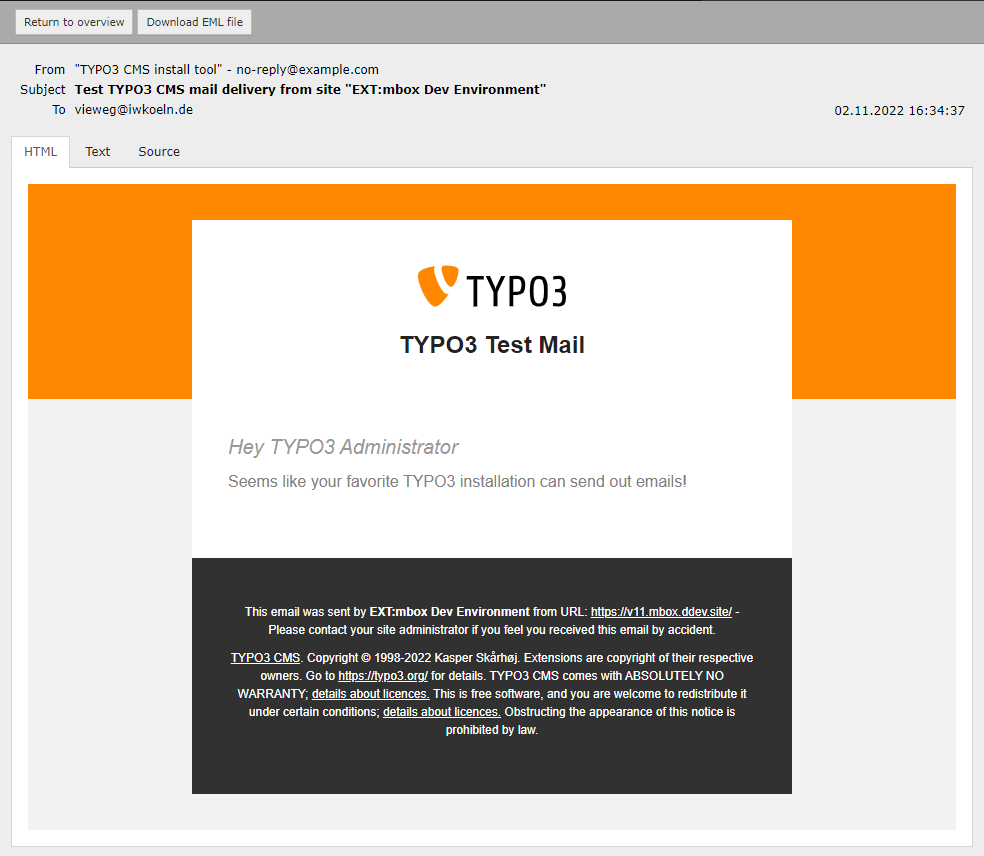
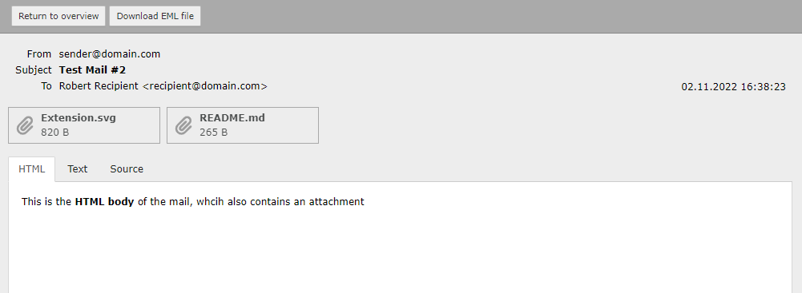

# EXT:mbox (Mail Client)

TYPO3 CMS backend module to view mbox file contents, like an email client.

This extension has been supported by [**Institut der deutschen Wirtschaft Köln Medien GmbH**](https://www.iwmedien.de/)


## Screenshots

### Inbox view



### Detail view (with HTML output)



### Detail view (with attachments)




## Features

- Simple web mail client for emails stored in local mbox file
- Sort mails by date (asc/desc) and store choice in BE-User session
- Configurable pagination
- HTML and text viewer
- Download attachments separately
- Download whole mail message as EML file (e.g. for Microsoft Outlook)
- Clear mbox (delete all mails) action
- Provides RFC 4155 compliant mbox mail transport (`T3\Mbox\MboxTransport`)


## Requirements

- TYPO3 11.5 LTS or 12
- PHP >=7.4


## Installation

Just install the extension, like any other TYPO3 CMS extension.

Link to TER: https://extensions.typo3.org/extension/mbox

For Composer, you can use:

```bash
composer require t3/mbox
```

## Configuration

To make EXT:mbox work you need to configure the TYPO3 mail configuration to use mbox, like this:

```php
<?php

$GLOBALS['TYPO3_CONF_VARS']['MAIL']['transport'] = 'T3\Mbox\MboxTransport';
$GLOBALS['TYPO3_CONF_VARS']['MAIL']['transport_mbox_file'] = '/var/www/html/path/to/mbox-file.mbox';
```

If you have different transport configured, the backend module will display an error notice.


## Extension Settings

In extension settings (under Admin Tools > Settings > Extension Configuration) you have two options:

### Mails per page

The amount of mails being displayed per page. Default: 10

### Debug mode

For debugging and testing purposes, there is a Symfony command shipped, which becomes only available,
when you enable the debug mode in Extension configuration. 

Don't forget to clear all caches from install tool, after enabling the debug mode.

The command got the name ``mbox:testmails:send`` and will send four test mails (with/without attachments).

## Dev Environment

The extension repository provides a DDEV environment to develop on EXT:mbox locally in TYPO3 11 and 12. 
You find more information [here](https://github.com/a-r-m-i-n/ddev-for-typo3-extensions).

### Minimum instructions

```bash
ddev start
ddev install-all
```

* Overview: https://mbox.ddev.site/
* TYPO3 11 Backend: https://v11.mbox.ddev.site/typo3/
* TYPO3 12 Backend: https://v12.mbox.ddev.site/typo3/
* Username: `admin`
* Password: `Password:joh316` (also in install tool)

## Links

- [Git Repository](https://github.com/a-r-m-i-n/mbox)
- [Issue tracker](https://github.com/a-r-m-i-n/mbox/issues)
- [EXT:mbox in TER](https://extensions.typo3.org/extension/mbox)
- [EXT:mbox on Packagist](https://packagist.org/packages/t3/mbox)
- [The author](https://v.ieweg.de)
- [The sponsor](https://www.iwmedien.de)
- [**Donate**](https://www.paypal.com/cgi-bin/webscr?cmd=_s-xclick&hosted_button_id=2DCCULSKFRZFU)
